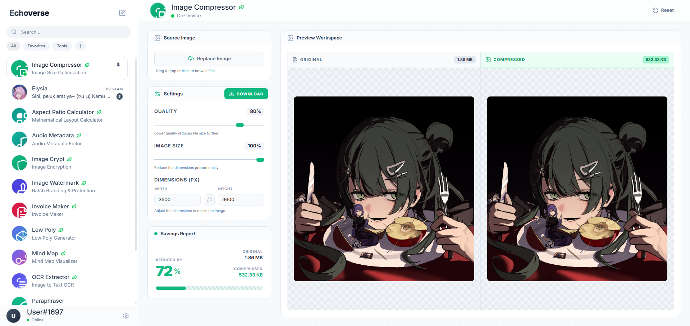

# Echoverse



Echoverse is a web application combining AI chat personas and a browser-based utility suite with client-side processing.

## Features

| Category | Description |
| :--- | :--- |
| **AI Chat Personas** | Interactive AI assistants for coding, writing, brainstorming, and translation with local memory persistence. |
| **Media Tools** | Background remover, image compression, cropper, watermark editor, low-poly generator, color palette extractor. |
| **Document Tools** | PDF studio, PDF compressor, format converters, in-browser OCR (Tesseract.js), invoice generator, mind map editor. |
| **Audio Tools** | ID3 metadata editor, audio studio waveform generator. |
| **Developer Tools** | Code snippet manager, code minifier, HTML reviewer, QR code generator, password generator. |
| **Multi-Provider AI** | Google Gemini, OpenAI, Groq, and OpenRouter endpoints. |
| **Client-Side Privacy** | On-device media and document processing using WebAssembly and WebGPU. |
| **Local Storage** | Chat histories and user preferences stored in IndexedDB via `localforage`. |

## Tech Stack

| Component | Technology |
| :--- | :--- |
| **Framework** | React 19, Vite, JavaScript |
| **Styling** | Tailwind CSS v4, Lucide Icons, Framer Motion |
| **AI Engine** | `@google/genai`, Custom OpenAI-Compatible Fetch Client |
| **Storage** | IndexedDB via `localforage` |
| **On-Device ML / WASM** | `@imgly/background-removal`, `onnxruntime-web`, `tesseract.js`, `jszip`, `browser-id3-writer` |

## Project Structure

```
echoverse/
├── api/                   # Serverless API proxy endpoints
├── public/                # Static assets, avatars, and icons
├── src/
│   ├── components/        # UI components and layout shells
│   │   ├── apps/          # 46+ Utility tool components
│   │   └── theme/         # AppShell, AppHeader, and shared UI controls
│   ├── config/            # Color themes and styling configurations
│   ├── hooks/             # Application state management (useEchoManager)
│   ├── lib/               # IndexedDB persistence and API helpers
│   ├── persona/           # AI persona JSON definitions
│   ├── tools/             # Standardized tool JSON definitions
│   └── services/          # AI provider engines and registry services
├── .env.example           # Environment template
├── TOOL_CREATION_GUIDELINE.md # Technical standards for building tools
└── package.json
```

## Development Setup

1. **Clone repository:**
   ```bash
   git clone https://github.com/indravoyager/echo.git
   cd echo
   ```

2. **Install dependencies:**
   ```bash
   npm install
   ```

3. **Configure environment:**
   ```bash
   cp .env.example .env
   ```
   Set `PHILIA_API_KEY` in `.env`.

4. **Start dev server:**
   ```bash
   npm run dev
   ```

## Production Build

To build static assets for production:

```bash
npm run build
```

Build outputs are saved to `dist/`.

## License

MIT
